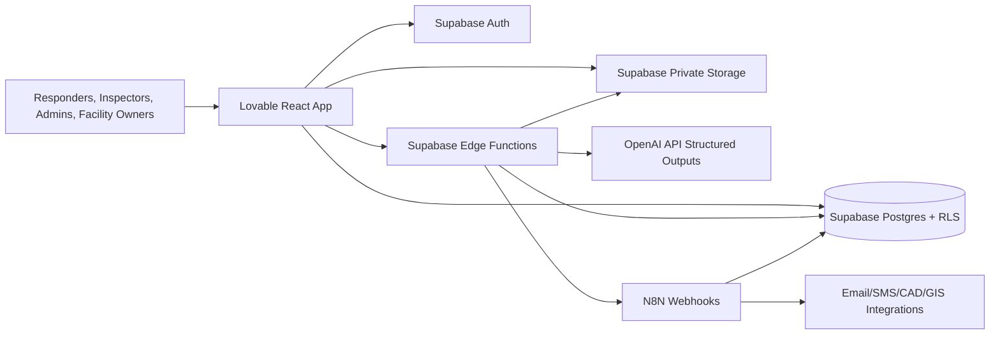

# First Responder Pre-Plan AI Platform Architecture

## Executive Summary

First Responder Pre-Plan AI is a secure multi-tenant SaaS platform for Fire, EMS, Police, Emergency Management, schools, hospitals, municipal buildings, industrial facilities, and private businesses. The platform centralizes building pre-plans, floor plans, hydrants, utilities, hazards, contacts, AI-generated response summaries, mobile incident dashboards, audit logs, PDF exports, and automation workflows while enforcing strict organization-level data isolation.

The architecture uses a Lovable React/TypeScript/Tailwind frontend, Supabase Auth/Postgres/Storage/Edge Functions backend, OpenAI structured outputs for operational summaries, and N8N for workflow automation. All tenant data is protected with Row Level Security (RLS), private storage buckets, signed URLs, scoped service roles, audit trails, and least-privilege API boundaries.

## Architecture Principles

- **Tenant isolation by default:** every tenant-owned table has `organization_id`, RLS enabled, and policies scoped to authenticated organization membership.
- **CJIS-style security posture:** least privilege, auditability, encryption in transit and at rest, MFA-ready auth, short-lived signed URLs, no public file buckets, and operational access controls.
- **Operational resilience:** Edge Functions validate membership before privileged work, workflows are idempotent, and exports/AI generations are tracked as jobs.
- **Mobile-first incident use:** response dashboard APIs prioritize low-latency summaries, critical hazards, access points, contacts, hydrants, utilities, and floor plan links.
- **Future integration readiness:** geospatial columns use PostGIS-compatible geometry/geography patterns, CAD/GIS imports are modeled as integration jobs, and provider-specific payloads are isolated in JSONB metadata.

## System Context



## Core Modules

1. **Organization & Membership**
   - Organizations represent departments, municipalities, businesses, schools, hospitals, or facility operators.
   - Users may belong to multiple organizations with role-based permissions.
   - Invites, membership status, and role assignments are auditable.

2. **Authentication & Authorization**
   - Supabase Auth handles identity, passwordless/OAuth/MFA-ready sessions.
   - Application authorization is enforced in Postgres via RLS and helper functions.
   - Service-role access is restricted to Edge Functions and N8N server-side workflows only.

3. **Building Profiles**
   - Building records store occupancy, address, coordinates, access notes, construction details, fire protection systems, key contacts, and response priorities.
   - Related tables model floor plans, hydrants, utilities, hazards, access points, contacts, and inspections.

4. **Private File Storage**
   - Files are stored in private Supabase Storage buckets.
   - Object metadata is mirrored in `building_files` for RLS-aware querying and audit trails.
   - Users receive signed URLs only after membership and building access checks.

5. **AI Response Summaries**
   - Edge Functions collect authorized building context and call OpenAI with a strict JSON schema.
   - AI output is stored in `ai_response_summaries` with model metadata, source hashes, and human review status.

6. **Incident Dashboard**
   - Mobile views aggregate high-priority building data into a responder-oriented payload.
   - Dashboard data includes hazards, utilities, hydrants, access points, contacts, summary cards, and signed floor plan links.

7. **Audit Logging**
   - Security-relevant actions write immutable audit events.
   - Audit records include organization, actor, action, resource, IP/user-agent context, and redacted metadata.

8. **PDF Export Engine**
   - Edge Function generates export jobs and returns generated PDF metadata.
   - PDFs are stored privately and linked to export jobs with RLS-protected metadata.

9. **N8N Automation**
   - Webhooks dispatch events such as building created, hazard changed, AI summary ready, export completed, or membership changed.
   - N8N calls back through secure Edge Function endpoints or Supabase service-role clients with scoped secrets.

## Data Isolation Model

- Every tenant-scoped table includes `organization_id uuid not null references public.organizations(id)`.
- RLS helper functions read `auth.uid()` and membership records to determine access.
- Writes require active membership and role capabilities.
- Cross-tenant administrative support requires explicit support access grants and is audited.
- Storage paths are prefixed with `organization_id/building_id/...` and validated against metadata tables.

## API Design

Frontend data access should use Supabase client queries for standard CRUD and Edge Functions for privileged or composite workflows.

### Supabase Client Queries

- `organizations`: list organizations for current user.
- `buildings`: CRUD scoped by organization membership.
- `building_contacts`, `building_access_points`, `hazards`, `hydrants`, `utilities`: CRUD scoped by building organization.
- `audit_logs`: read for organization admins only.

### Edge Function APIs

| Function | Method | Purpose | Auth |
| --- | --- | --- | --- |
| `generate-response-summary` | `POST` | Generate OpenAI structured incident summary for a building | Active org member with responder/editor/admin role |
| `export-preplan-pdf` | `POST` | Create private PDF export for a building pre-plan | Active org member with responder/editor/admin role |
| `n8n-dispatch` | `POST` | Dispatch signed platform event to N8N | Service-only or active admin event trigger |

### Function Request Examples

```json
{
  "organization_id": "00000000-0000-0000-0000-000000000000",
  "building_id": "11111111-1111-1111-1111-111111111111"
}
```

## OpenAI Structured Output Contract

AI outputs must validate to this contract before storage:

```json
{
  "incident_summary": "string",
  "life_safety_priorities": ["string"],
  "fire_attack_considerations": ["string"],
  "ems_considerations": ["string"],
  "law_enforcement_considerations": ["string"],
  "utility_shutdowns": [
    { "type": "gas|electric|water|sprinkler|alarm|other", "location": "string", "instructions": "string" }
  ],
  "known_hazards": [
    { "name": "string", "severity": "low|medium|high|critical", "response_note": "string" }
  ],
  "recommended_staging": ["string"],
  "confidence": 0.0,
  "review_required": true
}
```

## N8N Workflow Architecture

- **Inbound platform events:** Edge Function posts signed events to N8N webhook URLs.
- **Workflow categories:** notifications, inspection reminders, AI review routing, PDF delivery, CAD/GIS sync, facility owner requests.
- **Security:** N8N webhook secret rotation, HMAC signatures, replay protection with event IDs, and minimal service-role exposure.
- **Idempotency:** `workflow_events` stores event name, resource, payload hash, status, attempts, and last error.

## Security Model

- Enforce MFA for administrators and emergency management users when available.
- Use RLS on every tenant table and deny anonymous access.
- Keep all file buckets private; generate short-lived signed URLs in Edge Functions.
- Store API secrets only in Supabase Edge Function secrets and N8N credentials.
- Log all access to sensitive records, exports, AI generations, membership changes, and file downloads.
- Apply data retention rules for audit logs, exports, and AI prompt payloads.
- Redact secrets, SSNs, medical details, and protected records from AI prompts unless explicitly needed and authorized.
- Use least-privilege database roles and never expose service-role keys to the browser.

## Deployment Roadmap

1. **Foundation:** Supabase project, migrations, auth configuration, private buckets, RLS test suite.
2. **Tenant MVP:** organization onboarding, membership roles, building CRUD, contacts, hazards, hydrants, utilities.
3. **File & Mobile MVP:** floor plan upload, signed file access, mobile incident dashboard, audit logs.
4. **AI & Automation:** OpenAI summaries, review workflow, N8N event dispatch, PDF exports.
5. **Enterprise Hardening:** MFA enforcement, support access workflow, retention policies, monitoring, backup drills.
6. **Integrations:** GIS import/export, CAD incident feed adapters, municipal system connectors.

## MVP Sprint Plan

### Sprint 1: Security Foundation
- Create schema migrations and helper functions.
- Enable RLS and validate tenant isolation tests.
- Configure private storage bucket policies.

### Sprint 2: Building Pre-Plan CRUD
- Organization switcher and role-aware navigation.
- Building profile forms.
- Contacts, access points, hydrants, utilities, and hazards modules.

### Sprint 3: Floor Plans & Incident Dashboard
- Floor plan upload flow with private storage.
- Mobile responder dashboard API.
- Audit events for views, downloads, edits, and exports.

### Sprint 4: AI, PDF, and N8N
- OpenAI structured output Edge Function.
- PDF export Edge Function.
- N8N webhook dispatch and workflow event tracking.

### Sprint 5: Production Readiness
- Monitoring, backups, seed data, rate limits, security review, penetration-test fixes, and admin documentation.

## Production Readiness Checklist

- [ ] RLS enabled and tested on every tenant table.
- [ ] Anonymous role cannot read tenant data.
- [ ] Service-role key unavailable to frontend bundles.
- [ ] Storage buckets private with signed URL flows.
- [ ] Audit logging covers authentication, membership, files, AI, exports, and sensitive reads.
- [ ] OpenAI prompts redact unnecessary sensitive data.
- [ ] Edge Functions validate JWTs and membership before privileged work.
- [ ] N8N webhooks use HMAC signatures and replay protection.
- [ ] Backups, restore drills, and retention policies documented.
- [ ] Security headers, rate limits, and monitoring enabled.
- [ ] Incident response runbook completed.
- [ ] GIS/CAD integration contracts versioned.
